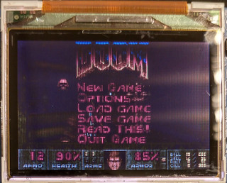

# OpenDingux for Retro Mini(RS-90) Handheld

  
## Introduction
Standing on the shoulders of giants again !   

Special thank Paul Cercueil who helps port Linux OS to this tiny handheld !  
https://github.com/pcercuei  
https://zcrc.me/RetroMini.html  

Since I might take some time to port something to this device, therefore, it is time to create this repository in order to release some binary files more easily ! And yes, I will also teach you how to build ubiboot, kernel and buildroot in wiki page. But you might need to download these files such as toolchain, source codes (ubiboot and kernel) firstly, they can be found from release page or from original Paul's github.
  
## Emulators
| Name | Picture | How to exit |
| -----|---------|---------------------|
| ccdoom |  | Press START  Try to delete .chocolate-doom in HOME folder if button don't work |
| wolf3D |  | Press SELECT |
| hheretic |  | Press SELECT |
| hhexen |  | Press SELECT |

## Website
-  https://steward-fu.github.io/website/index.htm

